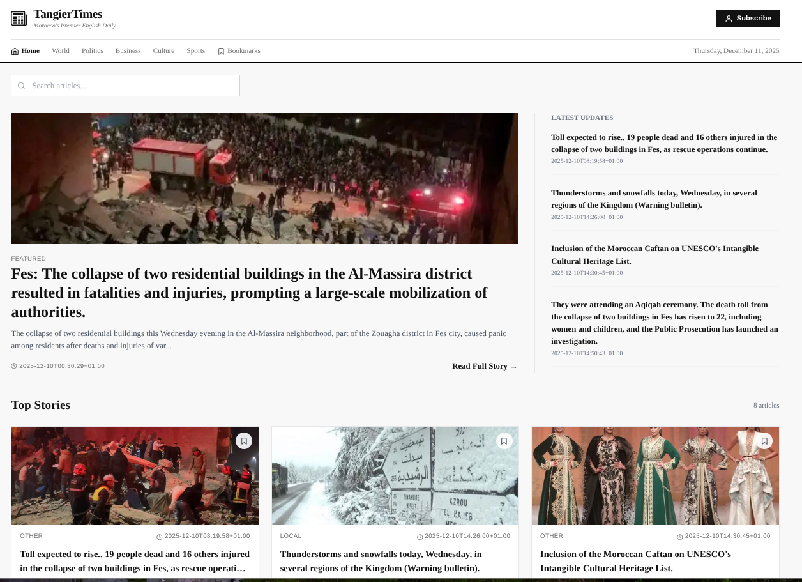
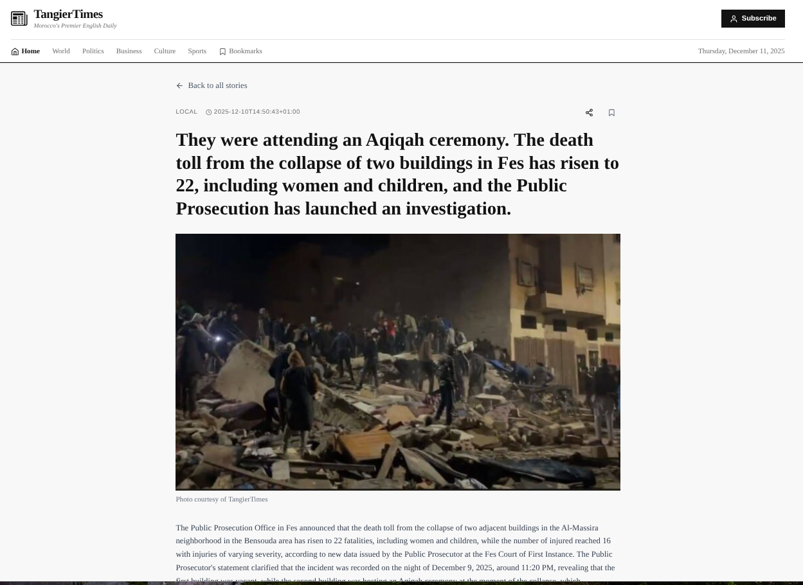

# AutoNews

AutoNews is a small full-stack project that scrapes news,translate and categorize them using AI, stores articles in a Laravel backend, and presents them in a React frontend (TangierTimes UI).

This repository contains three main workspaces:

- `backend/` — Laravel API and public assets
- `frontend/` — React (Vite) app used to browse articles
- `scraper_service/` — Python scraper and AI-processing scripts that ingest content into the database

This README gives quick setup steps, where to look for the important files, and how to run the project locally.

---

## Quick URLs (local dev)

- API (list articles): `http://127.0.0.1:8000/api/articles`
- Sample article image URL pattern: `http://127.0.0.1:8000/static/articles_images/<filename>`

---

## What each part does

- Backend: stores articles and serves them via a minimal REST API. Images are served from `backend/public/static/articles_images/`.
- Frontend: fetches the API and renders a news website UI with search and bookmarks (bookmarks saved to browser localStorage).
- Scraper: crawls configured sources, extracts text and images, runs translation/categorization (AI), downloads images into the backend images folder, and inserts records into the database.

---

## Getting started (summary)

Prerequisites: PHP 8.x, Composer, MySQL, Node.js (16+), Python 3.10+.

1) Backend (Laravel)

```bash
cd backend
composer install
cp .env.example .env
# edit .env to point to your DB and set APP_URL
php artisan key:generate
php artisan migrate
php artisan serve --host=127.0.0.1 --port=8000
```

2) Frontend (Vite + React)

```bash
cd frontend
npm install
npm run dev
```

3) Scraper (optional)

```bash
cd scraper_service
python -m venv .venv
source .venv/bin/activate
pip install -r requirements.txt
# copy .env.example -> .env and fill DB / AI keys
python src/main.py
```

Notes
- The scraper writes images into the backend public folder by default — ensure the path/permissions are correct.
- If the frontend or images appear broken, confirm the backend is running and that the image filenames stored in the DB match the files in `backend/public/static/articles_images/`.

---

## API

- `GET /api/articles` — returns an array of articles with fields such as `id`, `title_en`, `content_en`, `date`, `category`, `image_url`, `source_url`.
- `GET /api/articles/{id}` — returns a single article.

---

## Screenshots


### Home


### Article detail



