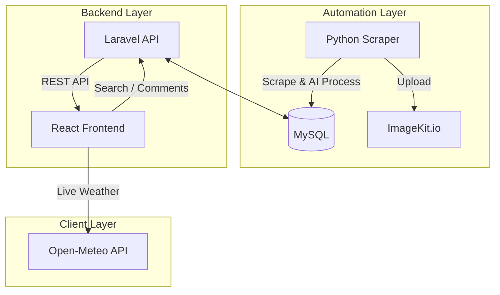
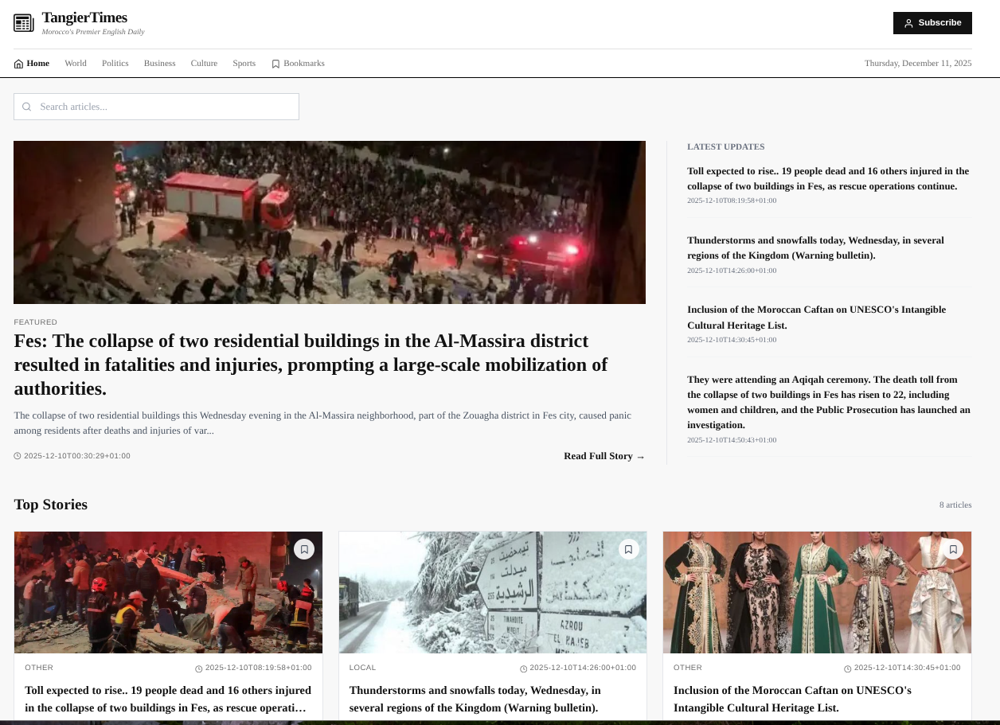
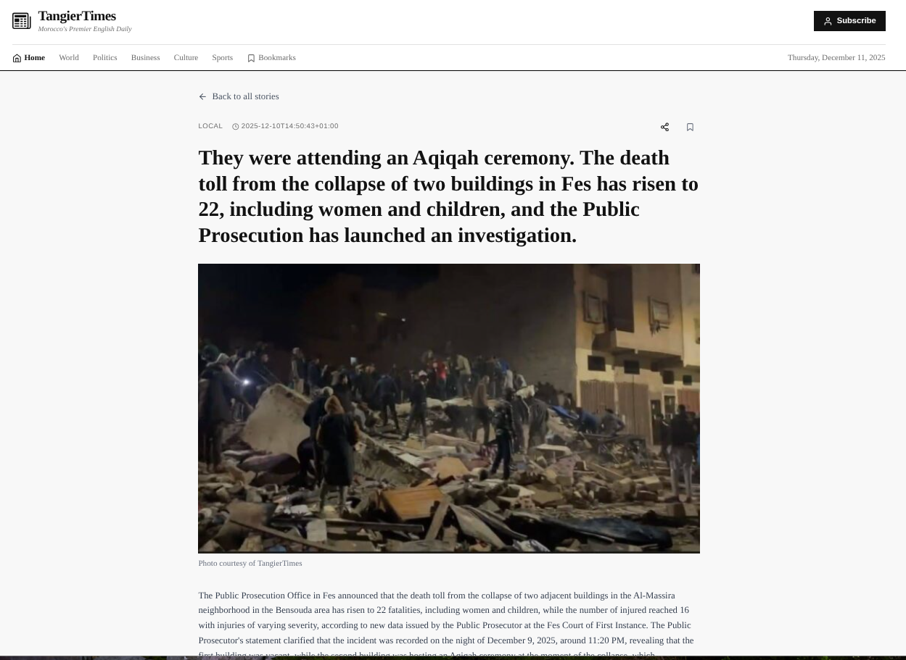

<div align="center">
  <h1 style="font-family: 'Playfair Display', serif; font-weight: 700; font-size: 3.5rem; border: none; margin-bottom: 0;">TangierTimes</h1>
  <p style="font-style: italic; color: #666; letter-spacing: 0.15em; text-transform: uppercase; font-size: 0.8rem; font-weight: 600; margin-top: -5px;">Morocco's Premier English Daily </p>

  

  <p>
    
    
    
    
    
  </p>
</div>

---

## 🌟 Overview

**TangierTimes** is a sophisticated, AI-driven news platform that automates the entire news lifecycle—from scraping and translation to delivery. Built with a modern, mobile-first design, it brings the latest stories from Morocco to a global audience with clarity and style.

### ✨ Key Features

- **🤖 AI-Powered Content**: Automated scraping, translation (AR/FR to EN), and intelligent categorization.
- **⚡ "Load More" Experience**: Infinite scrolling capabilities for a seamless news discovery journey.
- **🔖 Member Features**: Secure authentication, personal bookmarks, and a nested comment system.
- **🌦️ Real-time Insights**: Live weather for Tangier and dynamic search with instant suggestions.
- **📱 Mobile-First UI**: A premium, "New York Times" inspired aesthetic that adapts perfectly to any device.
- **🐳 One-Click Deployment**: Entire stack orchestrated via Docker for instant setup.

---

## 🏗️ Architecture


```mermaid
graph TD
    subgraph "Automation Layer"
        P[Python Scraper] --> |"Scrape & AI Process"| DB[(MySQL)]
        P --> |"Upload"| IK[ImageKit.io]
    end

    subgraph "Backend Layer"
        L[Laravel API] <--> DB
        L --> |"REST API"| R[React Frontend]
    end

    subgraph "Client Layer"
        R --> |"Search / Comments"| L
        R --> |"Live Weather"| WM[Open-Meteo API]
    end
```

---

## 🚀 Rapid Start

The fastest way to get TangierTimes running locally is with **Docker Compose**:

### 1. Prerequisites
Ensure you have [Docker Desktop](https://www.docker.com/products/docker-desktop/) installed.

### 2. Launch
```bash
# Clone the repository
git clone https://github.com/MohammedSerraj/AutoNews.git
cd AutoNews

# Launch the entire platform
docker-compose up --build
```

### 3. Access
| Service | URL |
| :--- | :--- |
| **Frontend UI** | [http://localhost](http://localhost) |
| **Backend API** | [http://localhost:8000](http://localhost:8000) |
| **Database** | `localhost:3306` (root:root) |

---

## 🛠️ Manual Installation (Development)

If you prefer to run services individually for active development:

### 🔹 Backend (Laravel)
```bash
cd backend
composer install
php artisan migrate
php artisan serve
```

### 🔹 Frontend (React + Vite)
```bash
cd frontend
npm install
npm run dev
```

### 🔹 Scraper (Python)
```bash
cd python
pip install -r requirements.txt
python main.py
```

---

## 📅 Environment Guide

| Key | Description | Found in |
| :--- | :--- | :--- |
| `DB_HOST` | Database address (use `db` for Docker, `127.0.0.1` for local) | `.env` |
| `APP_URL` | Base URL of your backend API | `backend/.env` |
| `VITE_API_URL` | API endpoint for the React frontend | `frontend/.env` |
| `GEMINI_API_KEY` | Key for AI translation and categorization | `python/.env` |
| `IMAGEKIT_PRIVATE_KEY` | Key for image processing and storage | `python/.env` |

---

## 📸 Screenshots

<div align="center">
  
  
</div>

---

<div align="center">
  <p>Built with ❤️ for Tangier, Morocco.</p>
  <p><b>© 2026 TangierTimes Team</b></p>
</div>
