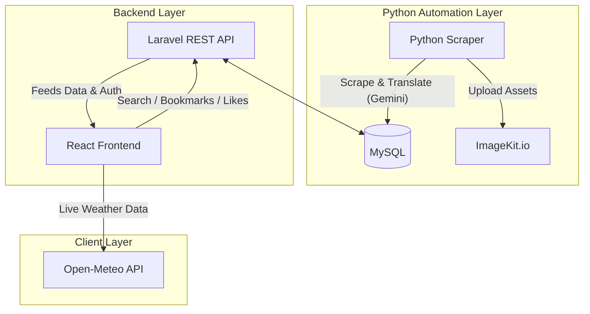

<div align="center">
  <h1 style="font-family: 'Playfair Display', serif; font-weight: 700; font-size: 3.5rem; border: none; margin-bottom: 0;">TangierTimes (AutoNews)</h1>
  <p style="font-style: italic; color: #666; letter-spacing: 0.15em; text-transform: uppercase; font-size: 0.8rem; font-weight: 600; margin-top: -5px;">Morocco's Premier English Daily • Automated News Platform</p>


  <p>
    
    
    
    
    
    
  </p>
</div>

---

## Video Demonstration

See TangierTimes in action in our full project walkthrough:

[](https://youtu.be/NiLSas0s970)

*(Click the image above to watch the video demo)*

---

## Overview

TangierTimes is a sophisticated, AI-driven news platform that automates the entire news lifecycle—from scraping local sources and translation to seamless user delivery. Built with a robust Laravel backend, an interactive React frontend, and an automated Python processing pipeline, it brings the latest stories from Morocco to a global audience with clarity, style, and extreme efficiency.

---

## Comprehensive Feature List

### Automation and AI Pipeline (Python)
- **Automated Web Scraping:** Runs a 24-hour recurring cycle to monitor and scrape https://tanjanews.com/news-sitemap.xml.
- **AI-Powered Translations:** Seamlessly translates headlines and full article content into English using the Google Gemini API.
- **Media Management:** Automatically downloads cover images and uploads them to ImageKit.io for fast global CDN delivery.
- **Seamless Database Persistence:** Processed articles are securely injected directly into the central MySQL database.


### Security, User Accounts and Interaction (Laravel Backend)
- **Multi-Channel Authentication:** Secure registration and login protected by Google reCAPTCHA, plus Social Login support (OAuth).
- **Engagement System:** Dual liking system supporting both registered users and guest interactions (via IP tracking).
- **User Discussions:** Deeply nested commenting system with support for threaded replies.
- **Personalization:** Bookmark and save favorite articles for later reading.
- **Robust API Layer:** Fully structured RESTful APIs powered by Laravel Sanctum.

### Production-Ready and SEO
- **SEO Optimized:** Metadata, semantic HTML, and correct heading structures designed for search visibility.
- **Social Media Ready:** Fully integrated Open Graph and social media sharing tags.
- **Legal Compliance:** Out-of-the-box templates for Privacy Policy, Terms of Service, and About Us pages.

### DevOps and Deployment
- **Containerized Architecture:** Fully dockerized across services (Frontend, Backend API, Web Nginx, DB, Scraper).
- **One-Click Launch:** Use Docker Compose to boot the entire stack instantly.

---

## Architecture Stack


```mermaid
graph TD
    subgraph "Python Automation Layer"
        P[Python Scraper] --> |"Scrape & Translate (Gemini)"| DB[(MySQL)]
        P --> |"Upload Assets"| IK[ImageKit.io]
    end

    subgraph "Backend Layer"
        L[Laravel REST API] <--> DB
        L --> |"Feeds Data & Auth"| R[React Frontend]
    end

    subgraph "Client Layer"
        R --> |"Search / Bookmarks / Likes"| L
        R --> |"Live Weather Data"| WM[Open-Meteo API]
    end
```

---

## Rapid Start Guide

The fastest way to get TangierTimes running locally is with Docker Compose:

### 1. Prerequisites
Ensure you have Docker Desktop installed.

### 2. Launch
```bash
# Clone the repository
git clone https://github.com/MohammedSerraj/AutoNews.git
cd AutoNews

# Launch the entire platform
docker-compose up --build
```

### 3. Access the Application
| Service | Local URL |
| :--- | :--- |
| **Frontend UI** | [http://localhost](http://localhost) |
| **Backend API** | [http://localhost:8000](http://localhost:8000) |
| **Database** | localhost:3306 (Credentials: root/root) |

---

## Manual Installation (Development)

### Backend API (Laravel)
```bash
cd backend
composer install
cp .env.example .env
php artisan key:generate
php artisan migrate
php artisan storage:link
php artisan serve
```

### Frontend UI (React + Vite)
```bash
cd frontend
npm install
npm run dev
```

### Automation Pipeline (Python)
```bash
cd python
python -m venv venv
source venv/bin/activate  # On Windows: venv\Scripts\activate
pip install -r requirements.txt
python main.py
```

---

## Environment Variable Guide

| Key | Description | Found in |
| :--- | :--- | :--- |
| `DB_HOST` | Database address (use `db` for Docker, `127.0.0.1` for local) | Root `.env`, `backend`, `python` |
| `APP_URL` | Base URL of your backend API | `backend/.env` |
| `VITE_API_URL` | API endpoint for the React frontend | `frontend/.env` |
| `VITE_RECAPTCHA_SITE_KEY` | Site key for Google reCAPTCHA | `frontend/.env` |
| `GEMINI_API_KEY` | Key for AI article translation and categorization | `python/.env` |
| `IMAGEKIT_PRIVATE_KEY`| Key for image processing and URL generation | `python/.env` |
| `GOOGLE_CLIENT_ID` | Client ID for Social Login | `backend/.env` |

---

<<<<<<< HEAD

